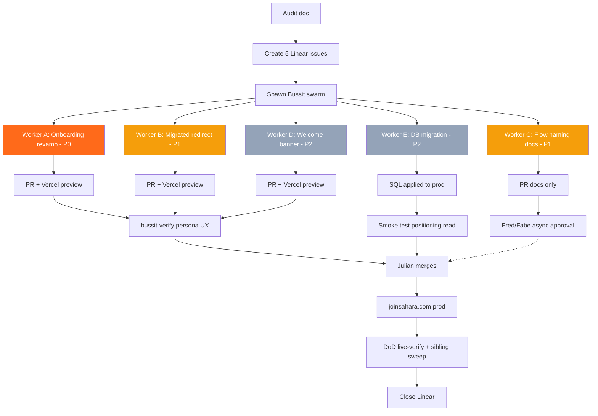

# Sahara Flow→New UI Gap Remediation — Visual Plan

Generated: 2026-04-22 12:22:27
Source: `/opt/agency-workspace/obsidian-vault/Projects/Sahara/2026-04-22-flow-vs-new-ui-audit.md`
Owner: Julian Bradley
Execution model: Linear issues -> Bussit swarm (parallel, git-worktree-isolated workers) -> PRs -> Vercel previews -> verify -> merge -> deploy

## ASCII Architecture

```
[Audit doc] -> [5 Linear issues] -> [Bussit swarm]
                                          |
        +--------+---------+--------+-----+----+--------+
        |        |         |        |          |        |
     Worker A  Worker B  Worker C  Worker D  Worker E
     Onboard  Redirect  FlowName  Banner    DB migr
     P0 (1+2)  P1 (3)    P1 (4)    P2 (5)    P2 (6)

     Each worker: worktree -> GSD quick -> impl -> test -> commit -> PR -> preview

        -> /bussit-verify (Stagehand persona) on A/B/D
        -> SQL smoke test on E
        -> Human approval for C (Fred/Fabe)
        -> Julian merge -> prod deploy -> DoD check -> close Linear
```

## Mermaid Dependency Graph



## Component Breakdown

| Worker | Gap(s) | Purpose | Inputs | Outputs | Dependencies | Est |
|---|---|---|---|---|---|---|
| A Onboarding revamp | 1 + 2 (P0) | Un-gate /onboarding + port three-pillar tone ("take lead / bite-sized / whole founder"). Combined to prevent file conflict. | Audit doc; app/onboarding/page.tsx; app/get-started/*; components/onboarding/welcome-step.tsx; components/welcome/journey-welcome.tsx | PR: public /onboarding + 3-pillar copy + Vercel preview | None | 1-2 hr |
| B Migrated-user redirect | 3 (P1) | /welcome detects user_metadata.imported_from=firebase, redirects to /dashboard/journey instead of /dashboard/reality-lens | app/welcome/page.tsx; Supabase auth.users.user_metadata | PR with conditional redirect + test + preview | None | 30 min |
| C Flow naming docs | 4 (P1) | Propose 2-3 naming options, prepare decision doc for Fred+Fabe, pre-stage code change for fast ship after approval | Audit doc; Obsidian vocab search; Linear history | Draft PR + .planning/decisions/flow-naming.md + Fred email | Fred/Fabe async approval | 1 hr |
| D Welcome-back banner | 5 (P2) | Dismissible banner gated on user_metadata.imported_from=firebase | app/dashboard/layout.tsx; new components/dashboard/welcome-back-banner.tsx; localStorage | PR + preview showing banner for migrated test user | None | 1-2 hr |
| E Positioning migration | 6 (P2) | Apply unapplied SQL migration to prod (ggiywhpgzjdjeeldjdnp) + backfill from enrichment_data.idea_pitch | Supabase service role creds (1P); supabase/migrations/20260323000001_add_product_positioning.sql | Migration applied + rows backfilled + smoke test | Prod Supabase access | 15-30 min |

## Flagged Risks

1. Workers A + B both touch auth-aware pages. Mitigation: A owns /onboarding+/get-started; B owns /welcome only. Files distinct.
2. Worker E is prod-DB-touching and irreversible. Requires explicit Julian approval before spawn.
3. Worker C outputs proposal only — it will NOT close its Linear issue same-day without Fred/Fabe approval.

## Definition of Done (per fleet rule)

For each worker's Linear issue to move to Done:
- [ ] PR merged to main
- [ ] Vercel prod deployment on merge commit = SUCCESS
- [ ] Live-verified at https://joinsahara.com
- [ ] Sibling sweep: grep for the same pattern elsewhere in the repo
