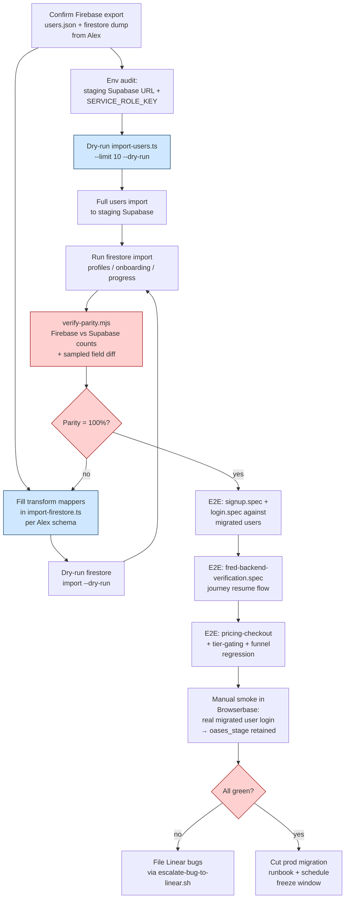

# Visual Plan — Firebase → Supabase Migration: Finish E2E Testing

> **Created:** 2026-04-24 16:28
> **Requested by:** Julian ("please finish all the testing with the issues with the database migration…")
> **Project:** Sahara (Fred Cary, joinsahara.com)
> **Urgency:** Stated urgent — end-to-end parity, real Firebase data reflected in Supabase.

---

## 1. ASCII Architecture Map

```
                    ┌─────────────────────────────────────┐
                    │   FIREBASE (source of truth — old)  │
                    │                                     │
                    │  ┌──────────────┐  ┌──────────────┐ │
                    │  │  Auth users  │  │  Firestore   │ │
                    │  │  (scrypt)    │  │  collections │ │
                    │  └──────┬───────┘  └──────┬───────┘ │
                    └─────────┼─────────────────┼─────────┘
                              │                 │
                    firebase auth:export   firestore-export
                              │                 │
                              ▼                 ▼
                    ┌─────────────────────────────────────┐
                    │  MIGRATION SCRIPTS (scripts/…/      │
                    │  firebase-to-supabase/)             │
                    │                                     │
                    │  import-users.ts ──► auth.admin     │
                    │  import-firestore.ts ──► tables     │
                    │  verify-parity.mjs ──► diff report  │
                    └─────────────────┬───────────────────┘
                                      │
                                      ▼
                    ┌─────────────────────────────────────┐
                    │   SUPABASE (target — Sahara v8)     │
                    │                                     │
                    │  auth.users (bcrypt + recovery link)│
                    │  profiles / onboarding / progress   │
                    │  feedback_signals, oases_stage, …   │
                    └─────────────────┬───────────────────┘
                                      │
                     ┌────────────────┴────────────────┐
                     ▼                                 ▼
        ┌────────────────────────┐        ┌──────────────────────┐
        │  Next.js app (Vercel)  │        │  E2E TEST HARNESS    │
        │  middleware + pages +  │◄───────│  tests/e2e/*.spec.ts │
        │  /api/*  (journey,     │        │  fred-backend-       │
        │  FRED chat, feedback)  │        │  verification +      │
        └────────────┬───────────┘        │  signup/login/       │
                     │                    │  pricing-checkout    │
                     ▼                    └──────────────────────┘
           ┌──────────────────┐
           │  Real user sign- │
           │  in verifies     │
           │  migrated data   │
           │  (100 % parity)  │
           └──────────────────┘
```

---

## 2. Mermaid Dependency Graph



Critical path: **A → B → D → G → H → J → K → L → M → P**. C and E can run in parallel once A+B land.

---

## 3. Component Breakdown Table

| Component | Purpose | Inputs | Outputs | Dependencies |
|---|---|---|---|---|
| `import-users.ts` | Create Supabase auth rows from Firebase users | `users.json` (firebase export), staging URL + service role key | Supabase `auth.users` rows w/ `firebase_uid` metadata + recovery links | Alex's Firebase Auth export |
| `import-firestore.ts` | Move Firestore docs → Supabase tables (profiles, onboarding, progress) | Firestore export dir, schema mappers | Supabase row inserts | Alex's Firestore schema dump; mappers filled in |
| `verify-parity.mjs` | Diff row counts + sample field values Firebase vs Supabase | Both exports | Parity report (pass/fail per collection) | Imports completed |
| `fred-backend-verification.spec.ts` | API-level E2E (FRED chat, journey, oases_stage) | Migrated user session | Pass/fail + stack trace | users + firestore import |
| `signup.spec.ts` / `login.spec.ts` | Auth flow against migrated recovery-link users | Test users from migration | Pass/fail + screenshots | users import |
| `pricing-checkout.spec.ts` / `tier-gating.spec.ts` | Paid/tier flows respect migrated subscription state | Migrated profile w/ tier | Pass/fail | firestore import (tier field) |
| `funnel-regression.spec.ts` | joinsahara.com funnel still converts post-migration | Public URL | Pass/fail + snapshots | Staging deploy of Next.js app |
| Manual Browserbase smoke | Real-user feel test: login as a migrated founder, resume journey | Staging URL + recovery email | Session replay URL as proof | All above green |
| Linear escalation (`escalate-bug-to-linear.sh`) | Any failure → issue assigned to Hitesh | Repro + logs | AI-XXXX issue | A failing check |

---

## 4. Open Questions for Julian (please answer before I start)

1. **Has Alex delivered the real Firebase export yet?** The README says it was blocked on Alex for: `users.json`, Firestore schema dump, Supabase admin access. Is all three in hand? If not, are we running this against `sample-firebase-export.json` only?
2. **Target Supabase project:** staging or Julian's `ggfzpyqmahvasfvwiqli`? I'll run nothing destructive against prod without explicit go-ahead.
3. **Scope of "urgent":** do you want me to (a) just run the existing test suite and report, or (b) also fill in the `import-firestore.ts` transform mappers if Alex's schema dump is now available?
4. **Are the `import-firestore.ts` mappers already written** (since README was from Apr 20)? If no, this blocks the end-to-end chain regardless of how urgent it is.
5. **Real data:** "all the real data from the firebase that's reflecting in the supabase" — should I re-run the import or just verify what's already there? If already imported, I'll start at step H (parity check) and skip D/G.
