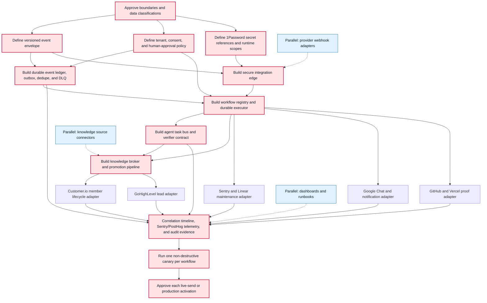

# Sahara Integration and Agent Knowledge Fabric — Visual Plan

Status: visual review only; no implementation has started.

## 1. Architecture map

```text
 EXTERNAL EVENTS                    SAHARA ENTRY POINTS                 OPERATIONS
 ┌──────────────────────┐          ┌──────────────────────┐          ┌─────────────────────┐
 │ Stripe / Twilio      │          │ App / Fred / Forms   │          │ Admin / Team        │
 │ LiveKit / Sentry     │          │ Member lifecycle     │          │ Linear / Google Chat│
 │ Linear / Customer.io │          │ Lead capture         │          │ GitHub / Vercel     │
 │ GHL / Firebase legacy│          └──────────┬───────────┘          └──────────┬──────────┘
 └──────────┬───────────┘                     │                                 │
            └──────────────────────┬──────────┴─────────────────────────────────┘
                                   ▼
                    ┌───────────────────────────────────────┐
                    │ SECURE INTEGRATION EDGE               │
                    │ signature + replay + rate checks      │
                    │ tenant/provider mapping + API auth    │
                    └──────────────────┬────────────────────┘
                                       ▼
                    ┌───────────────────────────────────────┐
                    │ VERSIONED EVENT ENVELOPE + LEDGER     │
                    │ event_id • correlation_id • tenant_id │
                    │ schema • consent • provenance • dedupe│
                    │ retry queue • outbox • dead-letter    │
                    └──────────────┬───────────────┬────────┘
                                   │               │
                         ┌─────────▼────────┐   ┌──▼────────────────────┐
                         │ POLICY GATE      │   │ OBSERVABILITY         │
                         │ tenant isolation │   │ Sentry / PostHog      │
                         │ consent + scopes │   │ logs / delivery proof │
                         │ human approvals  │   │ correlation timeline  │
                         └─────────┬────────┘   └──▲────────────────────┘
                                   ▼               │
                    ┌──────────────────────────────┴────────┐
                    │ WORKFLOW REGISTRY + DURABLE EXECUTOR  │
                    │ routing • idempotency • retry/backoff │
                    │ Trigger.dev jobs • state • canaries   │
                    └──────────────┬───────────────┬────────┘
                                   │               │
                        ┌──────────▼─────────┐ ┌───▼────────────────────┐
                        │ AGENT TASK BUS     │ │ KNOWLEDGE BROKER       │
                        │ typed task/run IDs │◄┤ scoped retrieval       │
                        │ capability routing │ │ provenance + freshness │
                        │ handoff + verifier │ ├────────────────────────┤
                        │ evidence + blocker │ │ Supabase + pgvector    │
                        └──────────┬─────────┘ │ Fred memory / Obsidian │
                                   │           │ Linear / deliverables  │
                                   │           └───────────▲───────────┘
                                   │                       │
                                   └──── findings ─────────┘
                                       (never secrets)
                                   ▼
                    ┌───────────────────────────────────────┐
                    │ OUTBOUND ACTION ADAPTERS              │
                    │ Customer.io: member lifecycle         │
                    │ GoHighLevel: consented leads/outbound │
                    │ Linear: issues/status • Sentry: bugs  │
                    │ Google Chat/email/SMS: team updates   │
                    │ GitHub/Vercel: build/deploy evidence  │
                    └──────────────────┬────────────────────┘
                                       ▼
                    ┌───────────────────────────────────────┐
                    │ READBACK + PROOF                      │
                    │ provider receipt • live-state canary  │
                    │ Linear evidence • PPP/client update   │
                    └───────────────────────────────────────┘

 SECRETS CONTROL PLANE (sidecar to every integration)
 ┌──────────────────────────────────────────────────────────────────────────────┐
 │ 1Password source of truth → scoped runtime injection → rotation/healthcheck │
 │ secret values never enter events, logs, agent messages, or knowledge stores │
 └──────────────────────────────────────────────────────────────────────────────┘
```

### Proposed workflow families

```text
[1] Webhook intake
provider event → verify → normalize → dedupe → policy gate → route → readback

[2] Bug maintenance
Sentry issue → signed bridge → Linear issue/update → agent diagnosis → verifier evidence

[3] Member lifecycle
Supabase member event → consent check → Customer.io draft/live campaign → delivery proof

[4] Lead operations
Sahara lead → approved field map + consent → GoHighLevel → follow-up → status readback

[5] Agent knowledge promotion
agent finding → provenance/confidence check → dedupe → optional approval → canonical knowledge

[6] Production proof
GitHub check → Vercel deployment → health/user-flow canary → Linear + team + PPP evidence

[7] Credential health
1Password reference → runtime availability check → expiry/permission alert → rotation workflow
```

## 2. Dependency graph



Critical path: approved boundaries → event/policy/secret contracts → durable ledger and secure ingress → workflow executor → agent/knowledge contracts → correlated proof → canaries → explicit activation.

Parallel opportunities: individual provider adapters, read-only knowledge connectors, and observability/runbook work can proceed independently after their shared contracts are approved.

## 3. Component breakdown

| Component | Purpose | Inputs | Outputs | Dependencies |
|---|---|---|---|---|
| Sahara entry points | Capture member, lead, admin, and Fred-driven intent | UI actions, forms, app/API requests | Authenticated commands and domain events | Existing Sahara auth and domain models |
| Provider adapters | Translate provider-specific webhooks and APIs | Stripe, Twilio, LiveKit, Sentry, Linear, Customer.io, GHL, Firebase legacy, GitHub/Vercel | Provider payload plus verified provider identity | Provider credentials and provider-specific signing rules |
| Secure integration edge | Reject forged, replayed, oversized, cross-tenant, or unauthenticated calls | Raw webhook/API requests | Accepted request or typed rejection | Secret references, tenant map, rate limits, clock tolerance |
| Event envelope and ledger | Give every event a durable identity, history, and replay-safe state | Accepted commands/events | Versioned normalized event, delivery attempts, DLQ entry | Shared schema, Supabase storage, retention policy |
| Secret control plane | Supply least-privilege credentials without exposing their values | 1Password item/field references, runtime identity | Scoped runtime credential availability and health status | 1Password, Vercel/Trigger runtime configuration, rotation policy |
| Policy and consent gate | Enforce tenant isolation, audience boundaries, consent, and approvals | Event, actor, tenant, consent and risk classification | Allow, deny, quarantine, or request approval | Approved data map and action-risk policy |
| Workflow registry and executor | Run durable multi-step workflows with idempotency and recovery | Approved normalized events | Step state, retries, compensation, terminal result | Trigger.dev, ledger/outbox, provider adapters |
| Agent task bus | Let agents request, hand off, verify, and close structured work | Workflow task, capability request, scoped context | Task/run state, evidence, typed blocker, verifier result | Stable task/run/correlation IDs, capability catalog |
| Knowledge broker | Give agents relevant, scoped, attributable context | Query, tenant, task purpose, authorization | Ranked knowledge with source, age, confidence, and classification | Supabase/pgvector, Fred memory, Obsidian, Linear, deliverables |
| Knowledge promotion pipeline | Turn agent findings into reusable knowledge safely | Finding, evidence, provenance, confidence | Rejected duplicate, approval request, or canonical knowledge record | Knowledge broker, dedupe, retention and human-review rules |
| Customer.io adapter | Operate Sahara member lifecycle communications | Canonical member events and consent | Profile/event sync, campaign action, delivery/readback | Supabase member truth; approved copy, domain and billing |
| GoHighLevel adapter | Operate consented lead capture and outbound follow-up | Audience Lab lead plus approved field/consent map | Contact/opportunity/workflow action and status readback | GHL private integration token/scopes; strict audience separation |
| Bug maintenance adapter | Maintain the signed Sentry-to-Linear bug loop | Sentry issue lifecycle and Linear webhooks | Deduplicated Linear issue/status plus agent task | Existing signed bridge, correlation IDs, verifier evidence |
| Team and client communications | Post concise completion/blocker updates to the right audience | Verified workflow result and evidence link | Google Chat/email/SMS/Slack message, Linear comment, PPP entry | Channel auth, recipient policy, explicit send rules |
| Deployment proof adapter | Distinguish code, CI, preview, production, and live behavior | GitHub checks, commit/PR, Vercel deployment, canary results | Evidence bundle and deployment state | Repository policy, Vercel/GitHub access, health and user-flow canaries |
| Observability and audit | Make every cross-system action diagnosable and provable | Correlation events, errors, delivery receipts, agent evidence | Sentry/PostHog signal, audit timeline, alert, support bundle | Redaction policy, shared IDs, retention and access controls |
| Human decision inbox | Hold irreversible, high-risk, or ambiguous actions | Approval-required workflow state | Approved, rejected, amended, or expired decision | Named approver, SLA, notification route, full evidence context |

## Decisions this visual asks the user to approve

1. Supabase remains Sahara's canonical member source; Firebase stays a reconciliation-only legacy source.
2. Customer.io owns member lifecycle messaging; GoHighLevel owns consented lead/outbound workflows.
3. Agents coordinate through typed tasks, events, evidence, and scoped knowledge—not direct secret sharing or unlogged messages.
4. 1Password remains the secrets source of truth; runtimes receive only the minimum scoped credential they need.
5. Live sends, production deployment, bulk imports, billing actions, and credential/access changes retain human approval gates.
6. Every workflow must produce provider readback and a correlation-linked evidence trail before it can be called complete.
