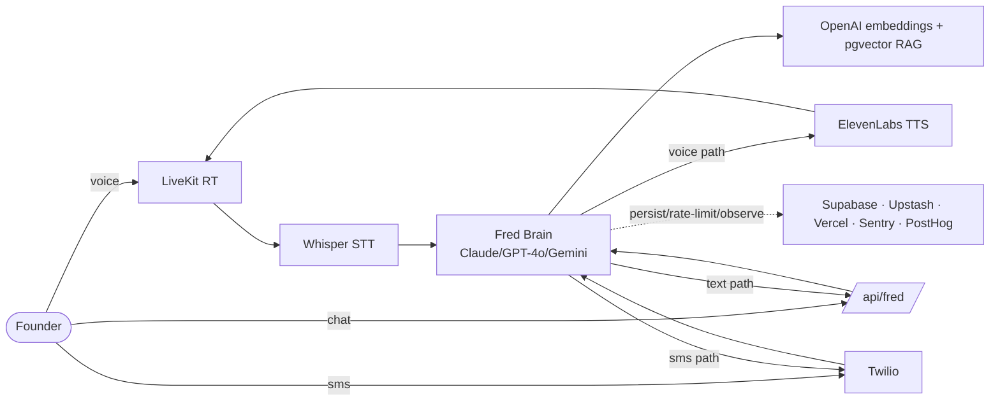

# Fred Communication — Itemized API Cost Estimate

> **Linear:** AI-6017 · **Prepared for:** William Hood · **Client:** Sahara — AI Founder OS (Fred Cary)
> **Source meeting:** Sahara Tech Meeting, 2026-03-30 (Fireflies `01KMXZJ66RDFWE2FB16ZK23T3X`)
> **Scope:** Per-API / per-credit cost of the infrastructure that powers **"Fred communication"** — every channel a founder uses to talk to Fred (voice, chat, SMS) — with each line item justified and tied to the real integrations shipped in this repo.

---

## 1. Executive summary

"Fred communication" is the set of channels through which a founder interacts with the Fred persona. It is built from three runtime pipelines, all grounded in code in this repo:

| Channel | Pipeline (code) | Paid APIs in the path |
|---|---|---|
| **Voice** | `workers/voice-agent/agent.ts`, `lib/agents/fred-agent-voice.ts` | LiveKit · OpenAI Whisper (STT) · OpenAI GPT-4o (LLM) · ElevenLabs (TTS) · Hume (optional prosody) |
| **Chat** | `lib/ai/fred-client.ts`, `lib/fred-brain.ts`, `lib/fred/*` | Claude Sonnet 4.5 / GPT-4o / Gemini 2.0 Flash (multi-provider) · OpenAI embeddings (RAG) |
| **SMS** | `lib/sms/fred-sms-handler.ts`, `lib/sms/client.ts` | Twilio (messaging) · Fred Brain LLM (same as chat) |

All three sit on shared platform services (Supabase, Upstash Redis, Vercel, Resend, Sentry, PostHog) that carry a small per-message marginal cost and a fixed monthly floor.

**Bottom line (blended estimate, moderate engagement):**

| Metric | Estimate |
|---|---|
| Variable API cost per **voice call** (~10 min) | **~$1.00** |
| Variable API cost per **chat message** | **~$0.02** |
| Variable API cost per **SMS exchange** (≤3 segments) | **~$0.05** |
| Variable comms cost per **active founder / month** | **~$5.70** |
| Fixed platform floor (all founders share) | **~$190 / month** |
| Fully-loaded comms cost at **100 founders** | **~$760 / month** |
| Fully-loaded comms cost at **500 founders** | **~$3,040 / month** |
| Fully-loaded comms cost at **1,000 founders** | **~$5,890 / month** |

These are **list-price estimates** before any committed-use / volume discounts (ElevenLabs Business, OpenAI/Anthropic scale tiers, Twilio committed volume), which typically cut the per-unit AI and voice costs 20–40% at the 500+ founder range. See §8 Assumptions.

---

## 2. Cost-flow architecture

```
                          FOUNDER
                             │
        ┌────────────────────┼────────────────────┐
        │ (voice)            │ (chat)             │ (sms)
        ▼                    ▼                    ▼
  ┌───────────┐        ┌───────────┐       ┌───────────┐
  │  LiveKit  │        │  Next.js  │       │  Twilio   │
  │  (RT room)│        │ /api/fred │       │  inbound  │
  └─────┬─────┘        └─────┬─────┘       └─────┬─────┘
        │ audio              │                   │ webhook
        ▼                    │                   ▼
  ┌───────────┐              │             ┌───────────┐
  │  Whisper  │ STT          │             │ fred-sms- │
  │ (OpenAI)  │              │             │  handler  │
  └─────┬─────┘              │             └─────┬─────┘
        ▼                    ▼                   │
  ┌─────────────────────────────────────────────┘
  │            FRED BRAIN  (lib/ai/fred-client.ts)
  │   multi-provider router + RAG over founder memory
  │   primary: Claude Sonnet 4.5 → GPT-4o → Gemini 2.0 Flash
  └───┬───────────────────────────────┬─────────────────┘
      │ text reply                    │ embeddings query
      ▼                               ▼
  ┌───────────┐                 ┌───────────┐
  │ElevenLabs │ TTS (voice only)│  OpenAI   │ text-embedding-3-small
  │ Fred voice│                 │ embeddings│  → Supabase pgvector
  └─────┬─────┘                 └───────────┘
        ▼
   back to LiveKit → FOUNDER hears Fred

  Shared, every message:  Supabase (persist) · Upstash (rate-limit) ·
                          Vercel (compute/egress) · Sentry · PostHog
```



---

## 3. Unit price reference (list prices, mid-2026)

| Service | Unit | List price | Notes |
|---|---|---|---|
| OpenAI GPT-4o | 1M input / 1M output tok | $2.50 / $10.00 | Voice LLM + chat fallback |
| OpenAI GPT-4o-mini | 1M in / 1M out | $0.15 / $0.60 | Cheap classification / SMS formatting |
| Anthropic Claude Sonnet 4.5 | 1M in / 1M out | $3.00 / $15.00 | Chat primary (`fred-client` primary provider) |
| Google Gemini 2.0 Flash | 1M in / 1M out | $0.10 / $0.40 | Chat fallback / high-volume |
| OpenAI Whisper STT | per audio-min | $0.006 | Voice transcription (`whisper-1`) |
| OpenAI `text-embedding-3-small` | 1M tok | $0.02 | RAG over founder memory |
| ElevenLabs TTS (Fred voice) | per spoken min* | ~$0.15 blended | *~1,000 chars ≈ 1 min; Business tier lowers this |
| Hume AI prosody (optional) | per audio-min | ~$0.03 | Emotion signal; can be disabled |
| LiveKit Cloud | per participant-min | ~$0.0005 + egress | Real-time transport |
| Twilio A2P 10DLC SMS (US) | per segment | ~$0.0079 + ~$0.003 carrier | 160 chars/segment |
| Supabase Pro | fixed + usage | $25 base | DB/auth/realtime/storage |
| Upstash Redis | per 100K cmd | ~$0.20 (pay-as-you-go) | Rate limiting |
| Vercel Pro | fixed + usage | $20 base + compute/egress | Hosting |
| Resend | per email | $20/100K (~$0.0002) | Transactional email |
| Sentry / PostHog | fixed + usage | ~$26 / ~$0 (free tier) | Errors / analytics |

---

## 4. Per-interaction cost — itemized & justified

### 4.1 One voice call (~10 minutes)

Assumptions: ~5 min founder speaking, ~5 min Fred speaking, ~10 conversational turns.

| Line item | Calc | Cost | Justification |
|---|---|---|---|
| Whisper STT | 5 user-min × $0.006 | $0.030 | Only the founder's audio is transcribed (`new openai.STT({ model: 'whisper-1' })`). |
| GPT-4o LLM | ~30K in + ~5K out tok | $0.125 | 10 turns carrying system prompt + Fred persona + rolling context (`gpt-4o`, temp 0.7). |
| ElevenLabs TTS | 5 Fred-min × $0.15 | $0.750 | Largest line. Fred's cloned voice (`ELEVENLABS_VOICE_ID`) renders every spoken reply. |
| LiveKit transport | 20 participant-min × $0.0005 + egress | $0.020 | Founder + agent = 2 participants in the room. |
| Hume prosody (optional) | 10 min × $0.03 | $0.300 | Emotion-aware responses; **toggleable** — excluded from headline number. |
| **Total (no Hume)** | | **~$0.95** | Round to **$1.00/call**. With Hume ≈ **$1.25**. |

➡ **Maps to internal credit model:** `voice_call_minute = 10 credits` → a 10-min call = **100 credits** (`lib/usage/credits.ts`). At a FREE allowance of 100 credits/mo, a single 10-min call exhausts the free tier — which is exactly why throttling + upsell shipped (AI-6486).

### 4.2 One chat message (Fred Brain)

| Line item | Calc | Cost | Justification |
|---|---|---|---|
| LLM (Claude Sonnet 4.5 primary) | ~4K in + ~600 out tok | $0.021 | Input = system + Fred persona + retrieved memory + recent history. |
| RAG embedding query | ~1K tok × $0.02/1M | <$0.0001 | One embedding per message to search founder memory (`document_search`). |
| pgvector search + Supabase write | negligible | ~$0.0005 | Persist message + similarity query on Supabase Pro. |
| Upstash rate-limit check | 1–2 cmds | ~$0.000004 | Per-request token-bucket. |
| **Total** | | **~$0.022** | Round to **$0.02/message**. |

➡ **Maps to:** `chat_message = 1 credit`. Gemini 2.0 Flash fallback drops this to **~$0.003/message** for high-volume / free-tier users — a deliberate cost lever in the provider router.

### 4.3 One SMS exchange (Twilio + Fred Brain)

| Line item | Calc | Cost | Justification |
|---|---|---|---|
| LLM reply | same as chat (often GPT-4o-mini for brevity) | $0.005–$0.021 | SMS responses capped at 480 chars / 3 segments (`MAX_SMS_LENGTH`). |
| Twilio outbound | up to 3 segments × ~$0.011 | $0.033 | A2P 10DLC + carrier fees. |
| Twilio inbound | 1 segment × ~$0.0075 | $0.008 | Founder's inbound message. |
| **Total** | | **~$0.05** | Round to **$0.05/exchange**. |

➡ SMS is the **most expensive per-character** channel because telecom fees dominate, not AI. Keep Fred terse on SMS (already enforced by the 3-segment cap).

---

## 5. Per-founder monthly cost (moderate engagement)

| Activity | Volume / mo | Unit | Monthly |
|---|---|---|---|
| Voice calls (10 min) | 4 | $1.00 | $4.00 |
| Chat messages | 60 | $0.02 | $1.20 |
| SMS exchanges | 10 | $0.05 | $0.50 |
| **Variable comms / founder** | | | **~$5.70** |

Engagement bands (for sensitivity):

| Band | Voice/mo | Chat/mo | SMS/mo | Variable / founder |
|---|---|---|---|---|
| Light | 1 | 20 | 4 | **~$1.60** |
| **Moderate** | 4 | 60 | 10 | **~$5.70** |
| Heavy ("power founder") | 12 | 200 | 30 | **~$17.50** |

---

## 6. Fixed platform floor (shared by all founders)

These are paid whether 1 or 1,000 founders are active; they amortize down per-founder as you scale.

| Service | Monthly floor | Why it's fixed |
|---|---|---|
| Supabase Pro | $25 | Base DB/auth/realtime project. |
| Vercel Pro | $20 | Hosting seat; compute/egress is usage-based on top. |
| ElevenLabs plan | ~$22–$99 | Subscription minimum unlocks the Fred voice + lower per-min rate. |
| LiveKit Cloud | ~$0–$50 | Free tier covers low volume; base appears at scale. |
| Sentry | ~$26 | Error monitoring team plan. |
| Upstash / PostHog / Resend | ~$0–$20 | Generous free tiers; mostly usage-based. |
| **Approx fixed floor** | **~$190 / mo** | Amortizes to $1.90/founder at 100, $0.19 at 1,000. |

---

## 7. Fleet projection (fully-loaded = variable + fixed floor)

| Active founders | Variable (moderate, $5.70 ea) | Fixed floor | **Total / mo** | Per founder |
|---|---|---|---|---|
| 100 | $570 | $190 | **~$760** | $7.60 |
| 250 | $1,425 | $190 | **~$1,615** | $6.46 |
| 500 | $2,850 | $190 | **~$3,040** | $6.08 |
| 1,000 | $5,700 | $190 | **~$5,890** | $5.89 |

**Read-out for William:** at 500 active founders, plan for **~$3.0K/month** in communication API spend at list price; expect **~$1.9K–$2.4K** after committed-use discounts. The dominant line is **ElevenLabs TTS** (voice), followed by **chat LLM** — both have direct cost levers (see §9).

---

## 8. Assumptions & caveats

- **List prices, mid-2026.** No committed-use/volume discounts applied. ElevenLabs Business, OpenAI/Anthropic scale tiers, and Twilio committed volume typically reduce per-unit cost 20–40% at 500+ founders.
- **Engagement is the #1 swing factor.** A 3× shift in voice-call frequency moves the whole estimate more than any provider price change.
- **ElevenLabs is metered in characters** (~1,000 chars ≈ 1 spoken minute); the per-minute figure is a convenience conversion and varies with speaking rate.
- **Hume prosody is optional** and excluded from headline numbers; enabling it adds ~$0.30/voice-call.
- **Provider routing matters.** Fred Brain (`lib/ai/fred-client.ts`) can fail over to Gemini 2.0 Flash, which is ~7× cheaper than Claude Sonnet 4.5 per token — routing more free-tier traffic there is the single biggest chat-side lever.
- Excludes one-off model fine-tuning / voice-clone setup and non-communication actions (deck review, investor score) — those are separate Linear line items.

---

## 9. Cost-control levers (already shipped or recommended)

| Lever | Status | Effect |
|---|---|---|
| Internal credit metering (`lib/usage/credits.ts`) | ✅ Shipped (AI-6487) | Every action priced in credits; honest per-action accounting. |
| Free-tier daily throttle + upsell (AI-6486) | ✅ Shipped | Caps free-user spend; converts heavy users to paid. |
| Provider router with Gemini fallback | ✅ In code | Route high-volume/free chat to Gemini 2.0 Flash (~7× cheaper). |
| SMS 3-segment cap (`MAX_SMS_LENGTH`) | ✅ Shipped | Bounds telecom cost per reply. |
| ElevenLabs Business / committed minutes | ▶ Recommended at 250+ founders | 20–40% cut on the largest line item. |
| Response caching of common Fred answers | ▶ Recommended | Skips LLM+TTS for FAQ-style asks. |
| Whisper → cheaper STT (e.g. GPT-4o-mini-transcribe) where quality allows | ▶ Optional | Marginal STT savings on voice. |

---

*Prepared by the AI Acrobatics fleet for William Hood — figures are estimates for budgeting and should be validated against the first 30–60 days of live billing telemetry (the usage-tracking system from AI-6487 captures the actuals needed to true these up).*
