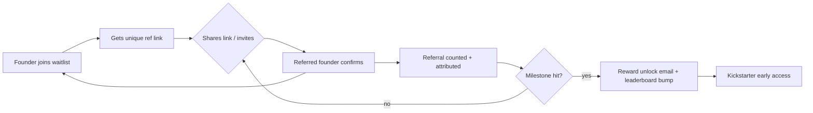
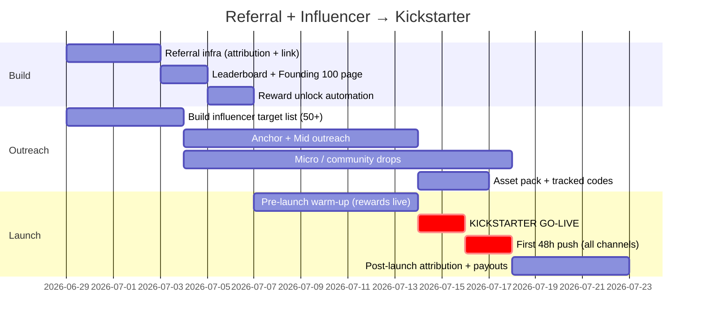

# Sahara — Referral Program + Influencer Outreach Plan (Kickstarter Launch)

> **Linear:** AI-7375 · **Prepared for:** Julian Bradley → Fred Cary · **Client:** Sahara — AI Founder OS (Fred Cary)
> **Source meeting:** Sahara Founders, 2026-04-08 · **DRIP:** Produce (julian-only) · **Labels:** high-value, paid-active
> **Goal:** Boost founder participation ahead of the Kickstarter launch through (1) a referral program and (2) influencer outreach, timed to the Kickstarter campaign.

---

## 1. Executive summary

The Kickstarter launch needs a self-reinforcing acquisition loop: existing waitlist founders bring more founders (referral program), and external reach is bought cheaply with credibility instead of ad spend (influencer outreach). Both feed the **same waitlist** so that when the Kickstarter goes live, there is a warm, pre-committed audience that converts in the first 48 hours — the window that determines whether a Kickstarter trends or stalls.

Sahara already ships a working referral primitive: `app/api/onboard/invite/route.ts` writes referred emails into `contact_submissions` with `source = "waitlist-referral"` and a `referredBy` pointer. This plan **extends that primitive** into a tracked, rewarded, leaderboard-driven program — no greenfield build required.

**Three workstreams, one timeline:**

| Workstream | Owner | Lever | Primary metric |
|---|---|---|---|
| Referral program | Eng (extend existing invite route) + Fred | Founder-to-founder virality | K-factor (referrals per founder) |
| Influencer outreach | Julian + Fred | Borrowed audience / credibility | Waitlist signups per influencer |
| Kickstarter launch ops | Fred + Julian | First-48h conversion | % waitlist → backers |

**Bottom line:** Ship the referral upgrade (~3–5 eng days), run a 4-week influencer outreach sprint, and synchronize the reward unlocks + influencer drops to the Kickstarter "go-live" so all demand lands in the trending window.

---

## 2. Where this sits in the current product

| Already in repo | File | Reuse for this plan |
|---|---|---|
| Waitlist + referral capture | `app/api/onboard/invite/route.ts` | Source of truth for referrals (`source: "waitlist-referral"`, `message.referredBy`) |
| Contact / waitlist store | Supabase `contact_submissions` | Add referral-tracking columns (see §5) |
| Rate limiting | `lib/api/rate-limit.ts` (Upstash) | Already guards invite spam (5/min/IP, cap 10 invites) |
| Email | Resend + React Email | Referral confirmation + reward unlock emails |
| Analytics | PostHog | Funnel + K-factor instrumentation |
| Payments | Stripe | Reward fulfillment (credits / discount) |

This means the referral program is an **extension**, not a new system. The influencer outreach is operational (people work), with light tracking support.

---

## 3. Referral program design

### 3.1 Mechanic (founder-facing)

1. Every founder on the waitlist / in-app gets a **unique referral link** (`joinsahara.com/?ref=<code>`).
2. Sharing the link or inviting by email (existing invite route) creates a `waitlist-referral` row attributed to them.
3. Rewards unlock at **referral milestones** (tiered, see below).
4. A **public leaderboard** ("Founding 100") gamifies it and signals momentum for the Kickstarter.

### 3.2 Reward tiers (Kickstarter-aligned)

| Tier | Referrals | Reward | Why it works |
|---|---|---|---|
| **Insider** | 1 | Move up the waitlist + early Kickstarter access (24h before public) | Low-friction first action |
| **Builder** | 3 | 1 month of Sahara Pro free at launch (Stripe credit) | Tangible product value |
| **Connector** | 5 | Founding-member badge + locked-in lifetime discount on Kickstarter tier | Status + savings |
| **Catalyst** | 10 | Free 1:1 with Fred Cary (15 min) + featured on the launch page | Access to Fred = the core draw |
| **Founding 100** | Top 100 referrers | Permanent "Founding Founder" status, name on the site | Scarcity + identity |

> Rewards are intentionally **product/credibility-based, not cash** — cash referrals attract fraud and the wrong audience; product access attracts real founders.

### 3.3 Anti-abuse (already partially covered)

- Existing route caps 10 invites/call and rate-limits 5/min/IP.
- Add: referral only counts when the referred email **confirms** (double opt-in) → prevents fake-email farming.
- Add: self-referral / disposable-domain block list.
- Reward fulfillment is **manual-review-gated** above Builder tier until volume justifies automation.

### 3.4 Funnel & virality (visual)

```
        ┌──────────────────────────────────────────────────────────┐
        │                    KICKSTARTER WAITLIST                   │
        └──────────────────────────────────────────────────────────┘
                 ▲                    ▲                     ▲
                 │                    │                     │
   ┌─────────────┴──────┐  ┌──────────┴─────────┐  ┌────────┴──────────┐
   │  REFERRAL PROGRAM  │  │ INFLUENCER OUTREACH │  │  ORGANIC / DIRECT │
   │  (founder → founder)│  │ (audience → founder)│  │   (ads, PR, SEO)  │
   └─────────┬──────────┘  └──────────┬──────────┘  └───────────────────┘
             │ unique ?ref link        │ tracked UTM / code
             ▼                         ▼
   contact_submissions          contact_submissions
   source=waitlist-referral     source=waitlist-influencer
             │                         │
             └──────────► reward unlock + leaderboard ◄──────────┘
                                   │
                                   ▼
                   KICKSTARTER GO-LIVE (first 48h push)
```



### 3.5 Engineering scope to ship it

| Task | Effort | Notes |
|---|---|---|
| Add `referral_code`, `referral_count`, `confirmed` cols to `contact_submissions` (or a `referrals` table) | 0.5d | Migration; keep existing route working |
| Generate + persist unique `referral_code` per signup | 0.5d | nanoid; backfill existing waitlist |
| `GET /api/referral/[code]` resolve + attribute on signup | 1d | Reads `?ref=` cookie → attribution |
| Double opt-in confirm step (email via Resend) | 1d | Gates reward counting |
| Leaderboard endpoint + public "Founding 100" page | 1d | Cache via Upstash; reuse dashboard UI patterns |
| Reward unlock automation (Stripe credit + email) | 1d | Manual-gate above Builder initially |
| PostHog events: `referral_sent`, `referral_confirmed`, `reward_unlocked` | 0.5d | K-factor dashboard |

**Total: ~5–6 eng days.** Sequence so the link + attribution + leaderboard ship first (the visible momentum signal), rewards second.

---

## 4. Influencer outreach plan

### 4.1 Target profile

Sahara serves **early-stage / first-time founders**. The right influencers are not mega-celebrities — they are **trusted operators and educators** whose audience IS founders:

| Tier | Who | Audience size | Ask | Comp model |
|---|---|---|---|---|
| **Anchor** | 2–3 well-known startup voices (founder-educators, accelerator-adjacent) | 100k–1M | Dedicated post + Kickstarter-day shout | Affiliate % of pledges + lifetime Sahara access |
| **Mid** | 10–15 startup/SaaS/indie-hacker creators (YouTube, X, LinkedIn, newsletters) | 10k–100k | Honest review / "I tried Sahara" + ref link | Free Pro + affiliate code |
| **Micro** | 30–50 niche founder communities, Slack/Discord mods, small newsletters | 1k–10k | Community drop + early access perk for their members | Early access + small flat fee or free access |

> **Fred Cary is the unfair advantage.** Fred is himself a recognizable founder voice (IdeaPros). Lead outreach with "build with Fred" — many mid/micro creators will engage because of who's behind it, not just the affiliate.

### 4.2 Channel mix

- **Newsletters** (highest intent for founders): sponsored mention or dedicated send timed to Kickstarter week.
- **YouTube**: "founder tools" / "AI for startups" reviewers — request a genuine walkthrough.
- **X / LinkedIn**: short-form founder operators; thread + ref link.
- **Communities**: indie hackers, accelerator alumni Slacks, founder Discords — micro-tier, high conversion.

### 4.3 Outreach sequence (per influencer)

1. **Warm personal DM/email** (not a template blast) — reference their specific content, why Sahara fits their audience, Fred's involvement.
2. **One-pager + demo access** (Sahara Pro comped for 30 days).
3. **Unique tracked code/link** (`?ref=<influencer-code>`, `source: "waitlist-influencer"`) so every signup is attributed and the affiliate is auditable.
4. **Kickstarter-day asset pack**: pre-written posts, graphics, the live link, the "first 48h" ask.
5. **Post-launch**: pledge attribution report + affiliate payout.

### 4.4 Outreach scripts (ready to send)

**Anchor / Mid cold email (subject: `Fred Cary's new founder tool — Kickstarter collab?`):**
> Hi {name} — I run growth for Sahara, the AI Founder OS built by Fred Cary (IdeaPros). Your {specific piece of their content} is exactly the audience we built this for — first-time founders who need investor-readiness, pitch feedback, and an always-on team.
>
> We're launching on Kickstarter on {date} and would love to set you up with free Pro access + a tracked affiliate link. If your audience backs us, you earn {affiliate %} of pledges and lifetime access. No scripted ad — just your honest take. 15 min this week to show you the product?

**Micro / community drop:**
> Hey {name} — building something your members will want early access to: Sahara, Fred Cary's AI operating system for founders. Can I give your community a private early-access link + perk before the Kickstarter goes public on {date}?

### 4.5 Influencer tracking

- Each influencer = one `referral_code` with `source: "waitlist-influencer"` (distinguishes from founder referrals).
- Reuse the same attribution + leaderboard infra from §3 — **one system, two source tags.**
- Weekly report: signups per code, confirmed rate, projected Kickstarter pledges.

---

## 5. Data model changes (concrete)

Extend `contact_submissions` (or add a sibling `referrals` table). Minimal migration:

```sql
-- referral attribution + tracking
ALTER TABLE contact_submissions
  ADD COLUMN IF NOT EXISTS referral_code   text UNIQUE,   -- this person's own code
  ADD COLUMN IF NOT EXISTS referred_by_code text,         -- who referred them
  ADD COLUMN IF NOT EXISTS confirmed        boolean DEFAULT false,
  ADD COLUMN IF NOT EXISTS referral_count   integer DEFAULT 0,
  ADD COLUMN IF NOT EXISTS reward_tier      text;         -- insider|builder|connector|catalyst

-- sources already used: 'waitlist', 'waitlist-referral'
-- add: 'waitlist-influencer' (influencer codes), distinguished by referred_by_code prefix
```

Existing `app/api/onboard/invite/route.ts` keeps working unchanged; the new fields are additive.

---

## 6. Timeline — synchronized to Kickstarter



| Phase | Window (relative to launch L) | Goal |
|---|---|---|
| T-4 to T-2 weeks | Build referral infra + influencer list | Plumbing + warm pipeline |
| T-2 to T-1 weeks | Referral live, outreach in motion | Waitlist grows, leaderboard visible |
| T-1 week | Rewards live, asset packs out | Pre-committed backers + influencers loaded |
| **Launch (L)** | Kickstarter live | All demand lands in first 48h |
| L+1 week | Attribution + payouts | Reward fulfillment, affiliate payouts, learnings |

---

## 7. Metrics & success criteria

| Metric | Definition | Target |
|---|---|---|
| **K-factor** | confirmed referrals ÷ active founders | > 0.4 (every 2.5 founders bring 1) |
| Referral confirm rate | confirmed ÷ invited | > 35% |
| Influencer signups | waitlist rows with `waitlist-influencer` | 1,000+ across all tiers |
| Waitlist → backer | Kickstarter backers ÷ pre-launch waitlist | > 15% in first 48h |
| Cost per signup | influencer comp ÷ attributed signups | < paid-ad CAC |
| Top-referrer concentration | % of referrals from top 20 founders | track (expect 80/20) |

PostHog dashboard tracks the referral funnel; a weekly influencer report tracks per-code attribution.

---

## 8. Risks & mitigations

| Risk | Mitigation |
|---|---|
| Referral fraud / fake emails | Double opt-in + disposable-domain block + manual reward review above Builder |
| Influencers ghost after free access | Tracked codes + affiliate-only-on-pledge comp; comp is mostly performance-based |
| Rewards over-promise (free Pro at scale) | Cap free-Pro months; gate Catalyst (Fred 1:1) by hard count |
| Demand lands before launch, not during | Time reward unlocks + influencer drops to launch week; early access = 24h pre-launch, not weeks |
| Eng slip delays referral infra | Ship link + attribution first (visible); rewards can lag by a few days |

---

## 9. Immediate next actions (for Julian)

1. **Approve reward tiers + influencer comp model** (§3.2, §4.1) — these are the only true decisions.
2. **Greenlight the ~5–6 eng-day referral extension** → file as a sub-issue under AI-7375, assign to fleet/Hitesh.
3. **Confirm Kickstarter launch date** so the timeline (§6) can be anchored to a real L date.
4. **Hand Fred the influencer target-list template** + the outreach scripts (§4.4) to start warm intros from his network this week.
5. **Confirm Fred 1:1 availability** for the Catalyst tier (the strongest incentive).

---

*Prepared by AI Acrobatics for Sahara. This is a strategy/production deliverable (AI-7375) — implementation of the referral infrastructure is scoped as a follow-up engineering sub-issue.*
